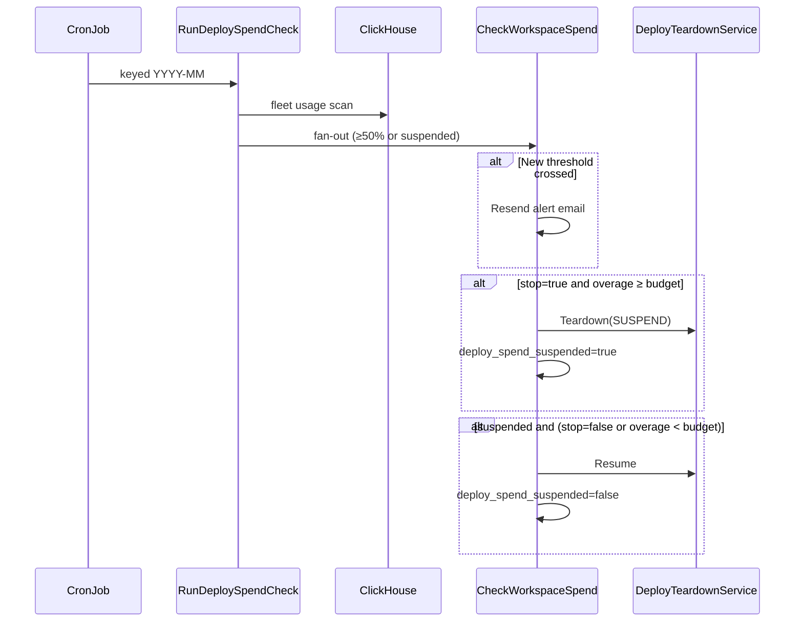

## Why this exists

Workspace admins can set a monthly Compute spend budget in the dashboard. The spend cap emails them at 50%, 75%, and 100% of that budget (measured as net-of-credit usage spend), and optionally stops all running Compute workloads when the budget is reached.

The check prices usage from ClickHouse with the same catalog rates as the hourly billing push, so enforcement matches what customers see on the billing page.

## How it works

A cronjob invokes `CronService.RunDeploySpendCheck`, keyed by billing period (`YYYY-MM`). The orchestrator:

1. Lists workspaces with a configured budget, plus any workspace that is currently spend-cap suspended (so it can resume after a budget raise, period roll, or budget removal).
2. Reads month-to-date Deploy usage for every workspace in one ClickHouse scan (instance meters + active keys).
3. Prices gross usage locally and computes `overage = max(0, gross - deploy_included_credit_cents)`.
4. Fans out to `DeploySpendCheckService.CheckWorkspaceSpend` for workspaces at or above the 50% alert threshold, or any suspended workspace.

Each per-workspace check owns threshold emails, the `deploy_spend_suspended` column, and suspend/resume via `DeployTeardownService`.



## Net-of-credit overage

Spend budgets apply to usage spend after included plan credits, not gross meter totals. The dashboard webhook persists `deploy_included_credit_cents` from Stripe credit grants on `invoice.payment_succeeded`. Until that value is known, the orchestrator skips non-suspended workspaces (no alerts, no enforcement) and the dashboard shows that credit is not yet known.

## Enforcement gates

- **New deployments** are blocked while `deploy_spend_suspended=true`.
- **Wake deployment** (preview environments) is also blocked while suspended.
- **Cancel Deploy** clears `deploy_spend_suspended` along with the plan entitlement.

## Cadence

The local dev cron runs **every 3 minutes** so alerts and enforcement are observable without a long wait. Production runs every 15 minutes (configured in the infra repo). Worst-case detection latency equals the cron cadence plus teardown drain time.

## Configuration

The worker needs ClickHouse (usage reader), Resend (`RESEND_API_KEY`), and WorkOS (`WORKOS_API_KEY`) for alert emails. Without Resend or WorkOS the check still runs and can suspend compute, but no email is sent.

Resend templates `compute-budget-alert` and `compute-budget-stopped` must be published (`web/internal/resend/scripts/sync-templates.tsx --publish`).

See [local development](/contributing/local/development) for `dev/.env.resend` and `dev/.env.workos`.

## Code layout

| Package | Responsibility |
| --- | --- |
| `svc/ctrl/worker/cron/deployspendcheck` | Orchestrator, per-workspace check, threshold math, alert emails |
| `svc/ctrl/worker/deployteardown` | Suspend (stop workloads, record snapshot) and resume |
| `web/apps/dashboard/.../spend-budget.tsx` | Budget UI and net-of-credit meter |
| `web/apps/dashboard/lib/trpc/routers/billing/deploy-budget` | Get/set budget preferences |

## Testing

```bash
mise exec -- bazel test //svc/ctrl/worker/cron/deployspendcheck:deployspendcheck_test
mise exec -- bazel test //svc/ctrl/integration:integration_test --test_filter=DeploySpendCheck
```

Integration tests cover suspend/resume, budget removal while suspended, and resuming when stopping is turned off.
