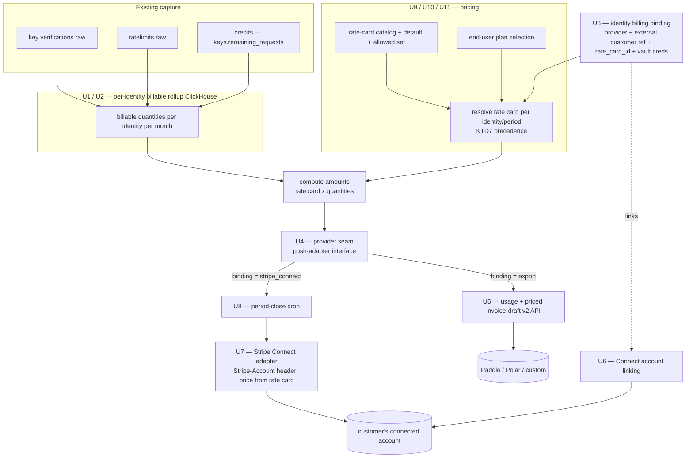

# Customer Usage Billing — Bill Your End-Users Natively - Plan

## Goal Capsule

- **Objective:** Let an Unkey customer bill their own end-users for usage that Unkey already captures (key verifications, standalone ratelimits, credits), without the customer exporting and re-aggregating data or running their own rating out-of-band. Deliver a per-end-user billable data layer, a billing binding on the identity, customer-defined rate cards (with end-user self-selection), a pluggable provider seam, a native Stripe Connect adapter, and a provider-agnostic export/invoice-draft API.
- **Scope tokens:** Ideation survivors #1 (per-identity rollup), #2 (identity as billing subject), #3 (customer-defined rate cards), #5 (Stripe Connect), #4 (export/invoice-draft as the "bring your own biller" path). Rate cards make Unkey the pricing source of truth: the customer defines a rate-card catalog and a default, and their end-users may pick from the allowed set. Because Unkey now computes money (not just quantities), the export path resolves real amounts and the Connect path is driven by the rate card. Still out of scope: embeddable usage widgets / full Portal billing dashboards beyond the plan-selection surface (ideation #6), and signed audit snapshots (#7).
- **Authority hierarchy:** This plan → the origin ideation doc → repo conventions in `AGENTS.md`. On conflict, repo conventions win for mechanics; the plan wins for scope.
- **Stop conditions:** Stop and surface a blocker if (a) the Stripe Connect charge model / account-type decision (KTD3) is rejected, since U6–U7 depend on it, or (b) implementation reveals that ratelimit identity attribution (U2) requires a hot-path change the team won't accept — U2's fallback (report-as-unattributed) then becomes the shipped behavior.
- **Execution profile:** Deep, payments-sensitive. Money-movement units (U7, U8) are test-first on idempotency and the Stripe `Stripe-Account` direct-charge contract.
- **Tail ownership:** Standard PR-per-unit or per-phase; follow repo conventions. Schema-touching units require `mise run generate` + `mise run bazel` before their tests pass.

---

## Product Contract

### Summary

Unkey holds the four inputs a billing engine needs — the metered event, the end-user identity, the ratelimit counters, and the credit balance — but only bills its *own* customers. This plan exposes that data as a per-end-user billing capability. A customer defines a **rate-card catalog** (tiered pricing over the metered dimensions) and a default; their **end-users may pick** a rate card from the allowed set. The customer picks a billing provider per identity, and Unkey either pushes priced usage to that provider (Stripe Connect, natively) or serves a usage export / priced invoice-draft the customer feeds to their own biller (Paddle, Polar, or anything else). Billable quantities come from one authoritative, idempotent per-identity rollup, and amounts come from the assigned rate card — so every downstream path reads the same numbers and the same money.

### Problem Frame

Today `billable_verifications_per_month_v2` and `billable_ratelimits_per_month_v2` aggregate only by `workspace_id` — there is no per-end-user billable number. `ratelimits_raw_v2` has no identity column, so standalone ratelimit usage cannot be attributed to an end-user at all. The `identities` table carries no billing fields. Unkey has a tiered-pricing engine (`web/internal/billing/src/tiers.ts`) but it is hardcoded to price Unkey's *own* subscriptions — customers cannot define their own pricing. The existing Stripe integration (`billingmeter`, `deploybilling` cron) bills Unkey's own customers and has no Stripe Connect / on-behalf-of path, and there is no customer-facing usage-export or invoice API. So a customer who wants to bill their users must query ClickHouse or the analytics API, re-aggregate per user, build their own rate table, and run their own billing — the friction this plan removes end-to-end.

### Requirements

**Metering and attribution**
- R1. Per-identity billable usage (VALID verifications, credits spent, passed ratelimits) is queryable per `(workspace_id, external_id/identity_id, period)` without scanning raw event tables at query time.
- R2. Standalone ratelimit usage is attributable to an end-user identity whenever the ratelimit is bound to a key or an identity; ratelimit usage that carries only a bare caller-supplied `identifier` is reported as unattributed rather than silently dropped or misattributed.
- R3. Billable quantities are idempotent under duplicate/replayed source inserts — the monthly `SummingMergeTree` collapses to one quantity per closed period regardless of insert replays, so a late-arriving or duplicate row never double-counts. Boundary: this holds for the long-TTL monthly rollup; raw-level reconstruction is limited by each raw table's TTL (verifications 90 days, ratelimits 1 month — see U2).

**Billing subject**
- R4. An identity can carry a billing binding: a provider selection (`stripe_connect` | `export` | `none`), a provider-side customer reference, and an assigned `rate_card_id` (nullable; falls back to the workspace default).
- R5. Provider credentials and connected-account references are stored encrypted via Vault, never as plaintext columns.

**Provider abstraction**
- R6. A provider seam supports both push providers (Unkey posts usage to the provider) and the pull/export path (the customer reads usage from Unkey), selected per identity via R4's binding.
- R7. Adding a new push provider requires implementing one interface plus registration, mirroring the existing `billingmeter.Pusher` extension pattern.

**Pricing and plan selection (#3)**
- R15. A customer can define a rate-card catalog: named rate cards, each a tiered price over the metered dimensions (per VALID verification, per `spent_credits`, per passed ratelimit), reusing the existing tiered-pricing engine. Currency is per rate card.
- R16. A workspace has a default rate card, and a customer can mark which rate cards form the **allowed set** an end-user may choose from.
- R17. An end-user (identity) may self-select a rate card from its workspace's allowed set; absent a selection, the identity's assigned `rate_card_id` (R4) applies, falling back to the workspace default.
- R18. Rate-card resolution for a period is deterministic and recorded, so an amount can always be traced to the exact rate card in force for that identity and period.
- R19. Unkey is the pricing source of truth: billable amounts are computed from the resolved rate card over the R1/R2 rollup quantities, for both the export path and the Connect path.

**Provider-agnostic export path (#4)**
- R8. A public `v2` API returns per-identity billable usage for a period as JSON, RBAC-scoped, following existing route conventions. (CSV is deferred — no content-negotiation seam exists today; see U5.)
- R9. A public `v2` API returns a priced invoice draft — line items per identity with amounts computed from the resolved rate card (R19) — that the customer posts to their own biller.

**Stripe Connect path (#5)**
- R10. Unkey posts metered usage as Stripe Billing Meter events to the customer's **connected account** using the direct-charge model (platform key + `Stripe-Account` header), keyed to the end-user's Stripe customer on that account.
- R11. Meter-event pushes are idempotent (dedup `identifier`) and respect Stripe's freshness window (timestamp within the past 35 days, ≤5 min future); corrections outside the window use meter event adjustments, never re-posts.
- R12. A period-close cron reads the per-identity rollup for the closed period and dispatches to each workspace's configured push provider.
- R13. Connect account linking captures and persists the connected account id (`acct_...`) for a workspace.

**Scope**
- R14. This plan produces both billable **quantities** (R1/R2 rollup) and priced **amounts** (R19, from the resolved rate card). Raw usage export (R8) returns quantities; the invoice draft (R9) and the Connect push carry amounts. Out of scope: embeddable usage widgets and full Portal billing dashboards beyond the plan-selection surface (#6), and signed audit snapshots (#7).

### Actors

- A1. **Unkey customer** — workspace owner who configures billing (defines rate cards + default + allowed set, chooses provider, links Stripe account, or consumes the export API).
- A2. **End-user identity** — the `identities` row that is the billable subject; the customer's own user/org. May self-select a rate card from the allowed set.
- A3. **Period-close cron** — Unkey worker that reads the rollup, resolves each identity's rate card, computes amounts, and dispatches to push providers.
- A4. **Billing provider** — the customer's Stripe connected account, or an external biller (Paddle/Polar) fed by the export path.

### Key Flows

- F1. **Native Stripe Connect billing.** A1 defines rate cards (R15) and links a Stripe connected account (R13), sets an identity's binding to `stripe_connect` with the end-user's Stripe customer id (R4). At period close, A3 reads the identity's billable quantities (R1, R2), resolves the rate card in force (R17, R18), and drives the connected-account meter/price (R10, R11, R19).
  - **Covered by:** R1, R2, R4, R10, R11, R12, R13, R15, R17, R18, R19
- F2. **Bring-your-own-biller export.** A1 sets an identity's binding to `export`. A1 (or their backend) calls the usage API (R8) for per-identity quantities, or the priced invoice-draft API (R9), and posts the result to Paddle/Polar/their own system.
  - **Covered by:** R1, R2, R4, R8, R9, R19
- F3. **End-user picks a plan.** A1 marks an allowed set of rate cards (R16). A2 calls the selection API (R17) to choose one from that set; the choice is recorded and resolves for the next period (R18). If A2 never picks, the assigned or default rate card applies.
  - **Covered by:** R16, R17, R18

### Scope Boundaries

**In scope**
- Per-identity billable rollup for verifications, credits, and (attributable) ratelimits.
- Identity billing binding + Vault-backed provider credentials.
- Customer-defined rate-card catalog + default + allowed set; end-user self-selection; amount computation (ideation #3).
- Push-provider seam + Stripe Connect adapter + period-close dispatch cron.
- Provider-agnostic usage-export and priced invoice-draft `v2` APIs.

**Deferred to follow-up work**
- Immutable signed billing snapshots for audit/disputes (ideation #7) — a follow-on hardening once real money moves.
- Native adapters beyond Stripe (a Polar push adapter) — the seam (R7) is built to accept them; only Stripe ships here.
- Embeddable end-user usage widgets and full Portal billing dashboards *beyond* the plan-selection surface (ideation #6) — the end-user plan-selection API/surface (U11) ships; rich usage/spend visualization does not.
- CSV export variant (U5 ships JSON-only; no content-negotiation seam exists yet).
- Full Connect onboarding UX polish beyond capturing the verified `acct_...` (U6 is the minimal link).

**Outside this plan's identity**
- Unkey becoming a general standalone billing product decoupled from its API primitives.

### Open Questions

- Q1. **(Deferred, confirm before U6/U7)** Stripe Connect charge model and account type. This plan assumes **direct charges + Standard connected accounts** (KTD3). If the business wants Unkey-branded onboarding or to be settlement MoR, that flips to Express/Custom + destination charges and materially changes U6/U7. Foundation units U1–U5 are unaffected.
- Q2. **(Resolve before committing KTD5, not after)** Meter aggregation semantics on the connected account — month-to-date absolute values against a `last`/gauge meter, or per-period deltas against a `sum` meter. This is not merely a dedup-identifier detail: the `billingmeter.Pusher` pattern this adapter mirrors uses **set-not-increment** (`last`) and needs no per-bucket identifier, whereas KTD5's deterministic `(identity, meter, period-bucket)` identifier is a `sum`/delta idiom. If the meter is `last`, KTD5's identifier scheme is wrong and a corrected re-post would be deduped away as a false duplicate (under-billing). Resolve against the live Stripe meter API at the start of U7, then set KTD5 accordingly.
- Q3. **(Deferred)** Whether `export`-bound identities also get a webhook (`invoice.ready`) or remain pull-only. Pull-only ships here; webhook is a follow-on.
- Q4. **(Business go/no-go — higher-order than Q1)** Does Unkey want to enter money-movement / merchant-adjacent territory at all? Shipping Stripe Connect (U6–U8) durably places an API-keys/ratelimit product near other people's money: it takes an `application_fee` cut, persists connected-account tokens, and runs a period-close billing cron. Q1 settles the charge-model *detail*; this question is whether the Connect arm is built at all, or whether the provider-agnostic export path (U5) is the whole product. The export path alone is a legitimate, lower-liability terminal scope.
- Q5. **(Demand / build-vs-buy — validate before Phase D)** This is greenfield (`ce-plan-bootstrap`) with a capability-derived premise ("Unkey holds the four inputs"), not a demand-derived one — there is no cited count of customers asking to bill end-users or running the DIY cookbook today. The call: is native billing worth building versus pointing customers at an existing meter vendor (Metronome/Orb/OpenMeter) fed by the U5 export? Now that rate cards are in scope, Unkey owns rating end-to-end (removing the earlier "R9 is thin without prices" concern), which *strengthens* the build case — but also raises the maintenance surface. Gather adoption signal (per the DoD product-outcome signal) from the priced export path before committing the Connect build.
- Q6. **(Resolve before U7)** Connect pricing mechanism from the rate card (KTD8): does Unkey **provision a metered Price on the connected account** from the rate card and post meter events against it, or **create priced invoice items directly** on the connected account from computed amounts? The first keeps Stripe as the presenter of usage; the second gives Unkey full control of the line items. Both are reachable via the `Stripe-Account` header under direct charges; resolve against the live Stripe API alongside Q2 at the start of U7.

### Sources

- Origin ideation: `docs/ideation/2026-07-01-customer-usage-billing-ideation.html` (survivors #1, #2, #3, #4, #5 and their bases).
- Rate-card engine to reuse: `web/internal/billing/src/tiers.ts` (tiered-price schema + accumulation) and `web/internal/billing/src/subscriptions.ts` (how Unkey declares its own tiers).
- Stripe Connect merchant-of-record: https://docs.stripe.com/connect/merchant-of-record ; direct charges: https://docs.stripe.com/connect/direct-charges ; meter events: https://docs.stripe.com/api/billing/meter-event/create ; legacy usage-record migration: https://docs.stripe.com/billing/subscriptions/usage-based-legacy/migration-guide
- Provider common-denominator: Polar event ingestion https://polar.sh/docs/features/usage-based-billing/event-ingestion ; Paddle (no meter primitive; one-time subscription charge) https://developer.paddle.com/api-reference/overview
- Repo seams: `svc/ctrl/internal/billingmeter/interface.go`, `svc/ctrl/worker/cron/deploybilling/`, `pkg/clickhouse/schema/`, `web/internal/db/src/schema/identity.ts`, `svc/api/routes/register.go`, `internal/services/analytics/service.go` (Vault-backed per-workspace secrets).

---

## Planning Contract

### Key Technical Decisions

- KTD1. **Aggregate on Unkey's side; never depend on provider aggregation.** The per-identity rollup (U1/U2) is the single authoritative source of billable quantities. Rationale: Paddle has no metering primitive and Polar attributes by receive-time, not event timestamp — only Unkey's rollup is consistent across providers and idempotent under re-runs. This is what makes one code path serve every biller.
- KTD2. **Provider seam = push-adapter interface + universal pull export.** Define a `MeterPusher` interface *shaped like* `billingmeter.Pusher` (`svc/ctrl/internal/billingmeter/interface.go:5-11`) but with its own per-identity types: push providers (Stripe Connect now, Polar later) implement it; the export/invoice-draft API is the lowest-common-denominator pull layer that needs no adapter. The identity's `billing_provider` selects push vs pull. Selection is a config-driven branch at the cron call site (no registry) until a second push adapter ships.
- KTD3. **Stripe Connect via direct charges + Standard accounts.** Authenticate with the platform key plus `Stripe-Account: acct_...`; the connected account owns Customer/Price/Subscription/meter events; take platform cut via `application_fee_amount`. Rationale: the connected account is merchant-of-record and bears KYC, dispute, and PCI liability, minimizing Unkey's exposure. Alternative — destination charges with `on_behalf_of` — makes the platform liable for negative balances and chargebacks; rejected unless Q1 flips.
- KTD4. **Rate cards are Unkey's pricing source of truth; the rollup is the quantity source of truth.** Amounts are computed from the resolved rate card (R19) over the rollup quantities (KTD1) — one authoritative number for quantity and one for money, read by both the export and Connect paths. Rationale: the user chose to have Unkey own pricing (rate cards, end-user-selectable), which removes the customer-owns-rating gap the review flagged. Reuse the existing tiered engine (`web/internal/billing/src/tiers.ts`) rather than building a new rating engine.
- KTD8. **Connect pricing derives from the rate card, not from customer-preconfigured Stripe Prices.** Since Unkey now holds the rate card, the connected-account Price/meter should be **provisioned from the rate card** (created on the connected account via the `Stripe-Account` header at link/first-bill time) rather than assuming the customer hand-configured a matching Price. This removes the fragile "assumes a meter exists" dependency the review flagged (see U7). The exact mechanism — provision a metered Price from the rate card vs. post priced invoice items directly on the connected account — is Q6.
- KTD5. **Idempotency is layered — but the Stripe layer is gated on Q2.** The rollup (U1) is the durable dedup: the SummingMergeTree collapses duplicate inserts, and because the source per-day `v3` views are themselves already-deduplicated rollups, the same closed period yields the same quantity. The Stripe `identifier` is near-term dedup only (uniqueness over a rolling ~24h window). **Do not fix the identifier scheme until Q2 is resolved:** if the connected-account meter aggregates with `last` (the set-not-increment idiom `billingmeter` already uses), correction is newest-timestamp-wins and a per-`(identity, meter, period-bucket)` identifier is wrong; if it aggregates with `sum`, the deterministic per-bucket identifier is right. Late events beyond Stripe's 35-day timestamp window are corrected with meter event adjustments, not re-posts (R11).
- KTD6. **Ratelimit attribution at ingestion, not query-time join.** Propagate `identity_id` into `ratelimits_raw` at check time when the ratelimit is bound to a key or identity. Rationale: the standalone ratelimit `identifier` is an arbitrary caller-supplied string that does not reliably resolve to an owning key/identity, so a rate-time MySQL join is unsound; a hot-path column write is the only correct source of attribution. Bare-identifier ratelimits stay unattributed (R2).
- KTD7. **Rate-card resolution is a fixed precedence, recorded per period.** For each identity and period, the rate card in force is: end-user self-selection (if the picked card is in the workspace's allowed set) → identity's assigned `rate_card_id` → workspace default. The resolved card id is recorded against the period so an amount is always traceable (R18) and a mid-period change applies to the *next* period, not retroactively — avoiding disputes from a bill that silently re-prices a closed period.

### High-Level Technical Design

Quantities come from the U1/U2 rollup; amounts come from the resolved rate card (KTD4/KTD7). The push path (Stripe) is cron-driven; the export path is pull-driven. Both read the same quantities and the same resolved rate card, so a customer's number is identical whichever way they bill.

### Assumptions

- Unkey owns pricing via rate cards (KTD4); the customer does **not** need to pre-configure a Stripe Price — the Connect Price is provisioned from the rate card (KTD8, Q6).
- The existing tiered-pricing engine (`web/internal/billing/src/tiers.ts`) is reusable for customer-defined rate cards, not only Unkey's own subscriptions.
- ClickHouse per-day views `key_verifications_per_day_v3` already preserve `external_id`/`identity_id`/`spent_credits` (confirmed feasible); the new rollup reads from them.
- Vault is available for per-workspace secret storage as used by `internal/services/analytics/service.go`.

### Sequencing

Phase A (U1, U2 — quantities) → Phase B (U3, U4 — subject + seam) → Phase E (U9, U10, U11 — rate cards + selection) → Phase C (U5 — priced export) → Phase D (U6, U7, U8 — Stripe Connect). **Ship through the priced export path (U5) first and gather adoption signal before committing the Connect build**, rather than running the Connect phase in parallel: the export path is the lowest-risk, lowest-liability shippable and, with rate cards, now delivers real priced invoices — while U6–U8 carry the money-movement liability and the Q1/Q4 go/no-go. Rate cards (Phase E) precede U5 because U5's invoice-draft now computes amounts from them. Gating Phase D on demonstrated export-path demand (Q5) — not merely on Q1 confirmation — preserves the de-risking the export-first design is for. Phase D additionally requires Q1 confirmed, Q4 answered yes, and Q2/Q6 resolved.

---

## Implementation Units

Units are numbered by creation order (stable U-IDs), not phase order. Execution phase order is in Sequencing: A (U1–U2) → B (U3–U4) → E (U9–U11) → C (U5) → D (U6–U8).

| U-ID | Title | Key files | Depends on |
|---|---|---|---|
| U1 | Per-identity billable rollup (verifications + credits) | `pkg/clickhouse/schema/041,042_*.sql` | — |
| U2 | Ratelimit → identity attribution + rollup | `pkg/clickhouse/schema/044–048_*.sql`, `types.go`, `svc/api` | U1 |
| U3 | Identity billing binding + rate-card fields + Vault creds | `web/internal/db/src/schema/identity.ts`, drizzle | — |
| U4 | End-user billing provider seam (push interface) | `svc/ctrl/internal/enduserbilling/{interface,noop}.go` | U3 |
| U5 | Usage-export + priced invoice-draft v2 API | `svc/api/routes/v2_billing_*`, `pkg/rbac/*` | U1, U2, U3, U10 |
| U6 | Stripe Connect account linking (verified) | Connect link handler, Vault | U3 |
| U7 | Stripe Connect meter/price adapter | `svc/ctrl/internal/enduserbilling/stripeconnect.go` | U4, U6, U10 |
| U8 | Period-close billing cron | `svc/ctrl/worker/cron/enduserbilling/*` | U1, U2, U3, U4, U7, U10 |
| U9 | Rate-card catalog + tiered pricing engine | `web/internal/db/src/schema/*`, reuse `tiers.ts` | U3 |
| U10 | Rate-card assignment + default + allowed set + resolution | MySQL schema, resolver | U9, U3 |
| U11 | End-user plan-selection surface (v2 API + Portal) | `svc/api/routes/v2_billing_*`, `web/apps/portal` | U10 |

### U1. Per-identity billable rollup (verifications + credits)

- **Goal:** Materialize per-identity billable quantities for verifications and credits spent, so R1 is satisfied without query-time raw scans.
- **Requirements:** R1, R3
- **Dependencies:** none
- **Files:**
  - `pkg/clickhouse/schema/041_billable_verifications_per_identity_per_month_v1.sql` (new — table + MV)
  - `pkg/clickhouse/schema/042_billable_credits_per_identity_per_month_v1.sql` (new — table + MV)
  - `pkg/clickhouse/` Go query methods for reading the new tables (mirror existing billable readers)
  - Corresponding `*_test.go` under the ClickHouse package
- **Approach:** Add `SummingMergeTree` tables keyed by `(workspace_id, external_id, identity_id, year, month)` and materialized views reading from the existing per-day `v3` views that already carry `external_id`/`identity_id`/`spent_credits` (confirmed in `pkg/clickhouse/schema` 004; pattern: `018_billable_ratelimits_per_month_v2.sql`, `019_...`). Sum VALID-outcome verification counts and `spent_credits`. Set a long TTL matching the monthly-rollup convention (per `035_instance_resources_per_month_v1.sql`, ~3–5 years). **Idempotency mechanism, stated precisely:** a ClickHouse MV fires on INSERT into its source and does not re-aggregate history on demand — so "re-materialization" is not an engine operation. The invariant is that the `SummingMergeTree` collapses duplicate keys on merge and the source per-day `v3` view is itself an already-deduplicated rollup, so a given closed period resolves to one quantity regardless of insert replays. A from-scratch rebuild (e.g. after a correction) is a separate, explicit backfill operation, not implied by the MV.
- **Patterns to follow:** `pkg/clickhouse/schema/018_billable_ratelimits_per_month_v2.sql` (billable rollup shape); `pkg/testutil/containers/clickhouse.go:82-144` (schema auto-apply in tests).
- **Execution note:** Confirm against the live per-day `v3` schema that `external_id` and `spent_credits` are present and grouped before writing the MV; the MV is only correct if the source view carries both.
- **Test scenarios:**
  - Happy path: seed verification rows for two identities in one workspace across two months; assert the rollup returns correct per-identity VALID counts and summed `spent_credits` per month.
  - Edge: identity with only RATE_LIMITED/USAGE_EXCEEDED outcomes contributes zero billable verifications but is still queryable.
  - Edge: verification rows with empty `external_id` (no identity) are excluded from per-identity rollup, not attributed to a blank key.
  - Integration/idempotency: replay duplicate inserts into the source for a closed period; assert the `SummingMergeTree` resolves to the same quantity after merge (no double-count) — Covers R3.
- **Verification:** Targeted ClickHouse package test passes; `mise run generate` and `mise run bazel` run after adding schema files.

### U2. Ratelimit → identity attribution and per-identity ratelimit rollup

- **Goal:** Attribute standalone ratelimit usage to an end-user identity where the ratelimit is bound to a key/identity, and roll it up per identity (R2); report bare-identifier ratelimits as unattributed.
- **Requirements:** R2, R3
- **Dependencies:** U1 (rollup conventions)
- **Files:**
  - `pkg/clickhouse/schema/044_ratelimits_raw_v3.sql` (new — a **new** raw table with `identity_id`/`external_id` columns). Do **not** ALTER `006_ratelimits_raw_v2.sql` in place: the schema loader (`pkg/testutil/containers/clickhouse.go:131-142`) runs CREATE-only statements and tolerates only `UNKNOWN_TABLE`/`TABLE_ALREADY_EXISTS`, so an ALTER (or re-CREATE) silently never adds the column and every attribution test reads defaults. A new `_v3` table is the only path the harness supports.
  - `pkg/clickhouse/schema/045..047_ratelimits_per_{minute,day,month}_v3.sql` (new — the intermediate MV cascade that propagates `identity_id`/`external_id` from raw → per-day; the per-identity billable MV must read a pre-aggregated view, not the raw table, to keep U1's idempotency guarantee)
  - `pkg/clickhouse/schema/types.go` (modify — add `identity_id`/`external_id` to the `Ratelimit` struct, ~line 28)
  - the ratelimit check/emit + buffer-flush path in `svc/api` (e.g. `svc/api/run.go` buffer wiring) plus the check-time code that resolves the key/identity binding
  - `pkg/clickhouse/schema/048_billable_ratelimits_per_identity_per_month_v1.sql` (new — table + MV over the attributed per-month view)
  - Corresponding `*_test.go`
- **Approach:** At ratelimit-check time, when the ratelimit is bound to a `key_id` or `identity_id` (per the MySQL `ratelimits` model), write that `identity_id`/`external_id` into the raw ClickHouse event (KTD6). Bare `identifier`-only ratelimits write null identity and are counted under an "unattributed" bucket the rollup exposes distinctly. The billable MV mirrors U1 but reads the new per-month `v3` view.
- **Patterns to follow:** `pkg/clickhouse/schema/006-010` (raw + rollup cascade); the verification path, which already carries `identity_id`/`external_id`, is the reference for propagating attribution into a raw event.
- **Execution note:** Commit to the new-table (`_v3`) path from the start — the schema auto-apply mechanism only creates tables, never alters them. Characterize the current ingestion write (`Ratelimit` struct + buffer flush) before changing it; the struct edit is easy to miss and would produce rows that compile but never carry the new field.
- **Retention caveat (R3 boundary):** `ratelimits_raw_v2` (and `_v3`) TTLs at **1 month** — *not* the 90 days U1's verification raw table uses. So attributed ratelimit rows expire after ~30 days and the raw ratelimit history cannot be reconstructed or re-attributed after that. R3 re-materialization applies to the **monthly rollup** (long TTL), but ratelimit billable quantities are **final-at-period-close and non-reconstructable from raw** once the raw window passes; a late correction on ratelimit usage cannot be honored. Either extend `_v3`'s raw TTL to cover the dispute window or accept this bound explicitly.
- **Test scenarios:**
  - Happy path: a ratelimit bound to an identity produces raw rows carrying that `identity_id`; the per-identity rollup attributes the passed count to it.
  - Edge: a bare-identifier standalone ratelimit produces rows with null identity; the rollup reports them under the unattributed bucket, not attributed to any identity — Covers R2.
  - Edge: a ratelimit bound to a key whose key has an `identity_id` attributes to that identity.
  - Integration/idempotency: replay duplicate inserts for a closed period; assert the monthly `SummingMergeTree` resolves to identical attributed counts after merge — Covers R3.
- **Verification:** Targeted ClickHouse + ingestion tests pass; `mise run generate`, `mise run bazel` after schema/Go changes.

### U3. Identity billing binding and encrypted provider credentials

- **Goal:** Give an identity a billing binding (provider, provider-side customer ref, assigned `rate_card_id`) and store provider credentials/account refs encrypted (R4, R5).
- **Requirements:** R4, R5
- **Dependencies:** none (can run parallel to U1/U2). The `rate_card_id` column is added here; the rate-card entity it references lands in U9, so ship the FK/nullable column now and wire resolution in U10.
- **Files:**
  - `web/internal/db/src/schema/identity.ts` (modify — add `billing_provider` enum, `billing_external_customer_id`, nullable `rate_card_id`, and the end-user's `selected_rate_card_id`)
  - `web/internal/db/src/schema/workspaces.ts` (modify — add encrypted provider-credential ref columns: `billing_provider_secret_ref` + `billing_provider_key_id`) **or** a new `workspace_billing_providers` table if per-provider rows are cleaner — decide in-unit
  - `web/internal/db/drizzle/00NN_*.sql` (generated migration)
  - Vault read/write helper wiring for the new keyring (mirror analytics service)
- **Approach:** Add drizzle columns and run `mise run generate` to emit the migration. `billing_provider` is an enum (`stripe_connect` | `export` | `none`, default `none`). Store the Stripe connected account id / provider API references encrypted via Vault under a per-workspace keyring (e.g. `workspace:{id}:billing`), persisting only the encrypted blob + `key_id` in MySQL — never plaintext (R5), following `internal/services/analytics/service.go` and `svc/vault/proto/vault/v1/service.proto`.
- **Patterns to follow:** `web/internal/db/src/schema/workspaces.ts` (existing `stripe_customer_id` shape); `web/internal/db/drizzle/0001_workable_wildside.sql` (ALTER migration shape); `internal/services/analytics/service.go:76-80+` (Vault encrypt/decrypt with per-workspace keyring).
- **Test scenarios:**
  - Happy path: set an identity's binding to `stripe_connect` with an external customer id; read it back.
  - Edge: default binding is `none`; identities untouched by billing are unaffected.
  - Error/security: provider credentials round-trip through Vault encrypt/decrypt; assert MySQL stores only ciphertext + `key_id`, never plaintext — Covers R5.
  - Migration: drizzle migration applies cleanly on an existing identities table without data loss.
- **Verification:** `mise run generate` produces the migration; web db tests pass; a Vault round-trip test passes.

### U4. End-user billing provider seam

- **Goal:** Define the push-provider interface that push adapters implement and the cron dispatches through (R6, R7).
- **Requirements:** R6, R7
- **Dependencies:** U3 (binding drives selection)
- **Files:**
  - `svc/ctrl/internal/enduserbilling/interface.go` (new — `MeterPusher` interface + its own per-identity `UsageRecord`/`PushRequest` types)
  - `svc/ctrl/internal/enduserbilling/noop.go` (new — noop adapter)
  - `*_test.go`
- **Approach:** Define a `MeterPusher` interface *shaped like* `billingmeter.Pusher` (`svc/ctrl/internal/billingmeter/interface.go:5-11`) but with its **own per-identity types** — `billingmeter.PushRequest` is workspace-grained (one `StripeCustomerID`, month-to-date totals), whereas this interface carries a per-identity `UsageRecord` set plus the resolved per-identity provider customer ref. Do **not** reuse `billingmeter`'s types. **No registry:** provider selection follows the existing `billingmeter` precedent — a config-driven `if/else`/`switch` at the U8 cron call site (mirror `svc/ctrl/worker/cron/cron.go:162-177`, where the Stripe-vs-noop choice is a few lines), not a dedicated `registry.go`. The seam still satisfies R7 (a new push provider is a new file implementing the interface + one branch at the call site); a registry earns its keep only when a second push adapter (e.g. Polar) actually ships.
- **Patterns to follow:** `svc/ctrl/internal/billingmeter/{interface,stripe,noop}.go`; the config-driven Stripe-or-noop wiring in `svc/ctrl/worker/cron/cron.go:162-177`.
- **Test scenarios:**
  - Happy path: the call-site selector returns the Stripe adapter for `stripe_connect`, noop for `export`/`none`.
  - Edge: unknown/empty provider resolves to noop, not a panic.
  - Integration: a fake adapter records the `UsageRecord`s it received unchanged from the dispatch call.
- **Verification:** Targeted `enduserbilling` package test passes; `mise run bazel` after adding Go files.

### U5. Provider-agnostic usage-export and invoice-draft v2 API

- **Goal:** Expose per-identity billable usage and a **priced** invoice draft over the public `v2` API for the export path (R8, R9), serving Paddle/Polar/custom billers.
- **Requirements:** R8, R9, R14, R19
- **Dependencies:** U1, U2 (rollup), U3 (binding for scoping), U10 (rate-card resolution + amount computation)
- **Files:**
  - `svc/api/routes/v2_billing_get_usage/handler.go` (new — `POST /v2/billing.getUsage`)
  - `svc/api/routes/v2_billing_get_invoice_draft/handler.go` (new — `POST /v2/billing.getInvoiceDraft`)
  - `svc/api/routes/register.go` (modify — register both routes)
  - `pkg/rbac/permissions/*.go`, `pkg/rbac/{rbac,check,urn}.go`, and the WorkOS permission-sync tool (modify — add a new `read_billing` action + `Billing` resource type; see execution note)
  - OpenAPI request/response types (generated) + `*_test.go` per route
- **Approach:** Follow the `v2_analytics_get_verifications` route pattern (`svc/api/routes/v2_analytics_get_verifications/handler.go`): zen.Route with `Method()`/`Path()`/`Handle()`, `protectedMiddlewares`, `zen.BindBody`, RBAC via `principal.Authorize`. `getUsage` returns per-identity billable quantities for a period (filter by identity/external_id/time), **JSON only** (see execution note on CSV). `getInvoiceDraft` returns priced line items per identity, with amounts computed by U10's resolver (resolved rate card × rollup quantities, KTD4/KTD7/R19) — it does **not** take caller-supplied prices; the price is Unkey's rate card. Both read the U1/U2 rollup and rely on the platform's existing per-key rate limiting (as `v2_analytics_get_verifications` does); bound the queryable period range to avoid wide period×identity scans on the shared rollup tables.
- **Patterns to follow:** `svc/api/routes/v2_analytics_get_verifications/handler.go` (route + RBAC + bind/validate); `svc/api/routes/register.go:579-586` (registration).
- **Execution note:** RBAC is **not** a reuse — no `read_billing` action or `Billing` resource type exists today, and `read_analytics` is scoped by API resource id, not key_space. Add a new `read_billing`/`Billing` resource-action pair *shaped like* the existing permissions and wire it through `pkg/rbac` and the WorkOS permission-sync tool. Separately, **CSV is not a config toggle** — every v2 route returns JSON via `s.JSON()` and OpenAPI declares only `application/json`; there is no CSV/content-negotiation seam. Ship JSON-only and defer CSV to a follow-up unit that adds the zen plaintext/CSV response path.
- **Test scenarios:**
  - Happy path: `getUsage` returns correct per-identity quantities for a period in JSON.
  - Happy path: `getInvoiceDraft` returns priced line items whose amounts equal U10's resolver output for the identity's resolved rate card and the period's quantities — Covers R9, R19.
  - Error: unauthorized principal is rejected by the new `read_billing` RBAC check; malformed period/filter fails validation.
  - Edge: an identity with zero usage returns an empty-but-valid result, not an error.
  - Edge: an identity whose resolved rate card is the workspace default (no assignment, no selection) prices correctly.
  - Integration: quantities returned by `getUsage` match the U1/U2 rollup; amounts in `getInvoiceDraft` match a direct `tiers.ts` computation for the resolved card.
- **Verification:** API route tests pass (`mise exec -- bazel test //svc/api/...`); OpenAPI regenerated via `mise run generate`; RBAC/WorkOS sync regenerated.

### U6. Stripe Connect account linking

- **Goal:** Capture and persist a workspace's Stripe connected account id so the adapter can target it (R13).
- **Requirements:** R13, R5
- **Dependencies:** U3 (credential storage)
- **Access control (required):** The link endpoint writes the reference that redirects where all downstream money is billed (U7/U8) — it is the highest-value endpoint in the plan. It must be **workspace-admin-only** RBAC, at least as strict as U5's `read_billing` scope. State the access-control decision explicitly; do not leave it unspecified.
- **Files:**
  - Connect account-link handler (new route or dashboard action) that completes the Stripe Connect OAuth / account-link flow and records the verified `acct_...`
  - Vault-backed persistence of the connected account reference (via U3's storage), plus an **unlink/revoke** path that deletes the encrypted reference
  - `*_test.go`
- **Approach:** Link via Stripe's **OAuth / account-link flow with a server-side-verified state token** (or an equivalent proof of control) — do **not** accept a caller-supplied `acct_...` string directly, or a malicious/compromised member could bind another merchant's account and redirect billing to it. Persist the verified `acct_...` encrypted per U3 (Standard account per KTD3). On unlink or workspace deletion, delete/tombstone the encrypted reference; U8 already treats a missing binding as skip-not-error. Full onboarding UX polish beyond capturing the verified `acct_...` is deferred (scope boundary).
- **Execution note:** Do not start U6 until KTD3/Q1 is confirmed and Q4 is answered yes — the account type (Standard vs Express/Custom) changes the onboarding call and the stored token shape, and Q4 decides whether the Connect arm is built at all.
- **Test scenarios:**
  - Happy path: completing the verified account-link flow stores the `acct_...` reference encrypted; adapter can retrieve it.
  - Error/security: a request supplying an arbitrary `acct_...` without completing the verified flow is rejected — Covers R13 (ownership).
  - Error/security: the link endpoint rejects a non-workspace-admin principal.
  - Error/security: stored reference is ciphertext, retrievable only via Vault — Covers R5.
  - Edge: unlink deletes the reference; a subsequent period-close skips the workspace cleanly.
- **Verification:** Targeted tests pass; Vault round-trip and unlink verified.

### U7. Stripe Connect meter-event adapter

- **Goal:** Implement the `MeterPusher` interface for Stripe Connect, provisioning the connected-account meter/price from the rate card and posting usage idempotently (R10, R11, R19).
- **Requirements:** R10, R11, R19
- **Dependencies:** U4 (interface), U6 (account id), U1/U2 (quantities), U10 (resolved rate card)
- **Files:**
  - `svc/ctrl/internal/enduserbilling/stripeconnect.go` (new — adapter)
  - `*_test.go`
- **Approach:** Construct the Stripe client (stripe-go supports `SetStripeAccount` for the header) and operate on the connected account via the `Stripe-Account: acct_...` header (KTD3/R10). **Provision the meter/Price on the connected account from the resolved rate card** (KTD8) rather than assuming the customer pre-configured one; the exact mechanism (metered Price from the rate card vs. priced invoice items) is Q6. Then post `POST /v1/billing/meter_events` carrying the connected-account customer id and the quantity. **First, resolve Q2** (absolute-`last` vs delta-`sum` meter semantics) against the live meter config, then set the dedup scheme accordingly (KTD5) — a per-`(identity, meter, period-bucket)` identifier is correct for `sum`, wrong for `last`. Reject/handle events outside the 35-day timestamp window; route corrections through meter event adjustments rather than re-posting. **Verify the connected-account customer exists before posting** (or handle the not-found error explicitly) — a first bill for a mis-configured customer otherwise fails at cron time, after the period is closed, with no interactive feedback. Reuse the `sdkLogger` wrapper and construction pattern from `billingmeter/stripe.go`.
- **Patterns to follow:** `svc/ctrl/internal/billingmeter/stripe.go:65-112` (Stripe client construction + meter-event post shape).
- **Execution note:** Do not start U7 until KTD3/Q1 is confirmed (the account type sets the auth scheme) and Q2 is resolved (it sets the dedup scheme). Test-first on idempotency and the `Stripe-Account` header contract — double-billing is the critical failure mode. Use a Stripe test/mock; assert the header and identifier on every posted event.
- **Test scenarios:**
  - Happy path: a per-identity usage set posts one meter event per meter to the connected account with the `Stripe-Account` header and the correct customer id and quantity.
  - Edge/idempotency: posting the same period twice under the resolved-Q2 scheme does not double-bill; a corrected re-post is not silently deduped away — Covers R11.
  - Error: an event with a timestamp older than 35 days is not posted as a normal event; the adapter routes it to an adjustment path or surfaces it — Covers R11.
  - Error: a missing target meter or missing connected-account customer surfaces as an actionable error (skip+alert), not a silent no-op or a push to the platform account.
  - Error: a missing/invalid connected account id fails cleanly without pushing to the platform account.
- **Verification:** Adapter tests pass against a Stripe mock; `mise run bazel` after adding Go files.

### U8. Period-close billing cron

- **Goal:** At period close, read the per-identity rollup, resolve each identity's rate card, and dispatch each workspace's identities to their configured push provider (R12).
- **Requirements:** R12, R3, R18
- **Dependencies:** U1, U2, U3, U4, U7, U10 (rate-card resolution)
- **Files:**
  - `svc/ctrl/worker/cron/enduserbilling/handler.go` (new — mirror `deploybilling`)
  - `svc/ctrl/worker/cron/enduserbilling/{billing,push}.go` (new)
  - `svc/ctrl/worker/cron/cron.go` (modify — register the new cron task + wire the config-driven adapter selection, per U4)
  - `*_test.go`
- **Approach:** Mirror `deploybilling`: take the billing period as the object key, read per-identity billable quantities from the U1/U2 rollup for the window, resolve each identity's binding (U3) and rate card in force (U10/KTD7, recording the resolved card per R18), and dispatch `stripe_connect`-bound identities through the U4 interface → U7 adapter, fanning out in batches (pattern: `deploybilling/push.go`). `export`/`none` identities are skipped on the push path (served by U5). Idempotency: the rollup is stable, and the adapter's dedup scheme (KTD5) handles near-term replays.
- **Cardinality note (load-bearing):** `deploybilling` pushes **one** month-to-date total per *workspace*; this cron pushes one meter event per *(identity, meter)* — the fan-out scales with the customer's **end-user count**, not customer count. A workspace with 100k billable identities is 100k+ Stripe calls in one period-close window, against the connected account's per-account rate limits and the 35-day/5-min-future timestamp constraints. State the assumed per-workspace identity cardinality and implement rate-limit-aware backoff and a bounded per-window batch/spread so a large population does not exhaust the Stripe rate limit or push events outside the meter's valid window. Do not rely on the unbounded `deploybilling` fan-out shape.
- **Patterns to follow:** `svc/ctrl/worker/cron/deploybilling/{handler,billing,push}.go`; cron registration at `svc/ctrl/worker/cron/cron.go:162-246`.
- **Test scenarios:**
  - Happy path: a period with `stripe_connect`-bound identities dispatches each to the adapter with correct quantities.
  - Edge: `export`/`none`-bound identities are skipped, not pushed.
  - Edge: a workspace with no linked connected account is skipped with a warning, not a failure.
  - Edge/scale: a workspace with a large identity population stays within the Stripe rate limit (backoff engages) and posts all events inside the valid timestamp window.
  - Integration/idempotency: re-running the cron for the same closed period does not double-bill — Covers R3, R12.
  - Integration: the amount pushed for an identity equals U10's resolver output for its resolved rate card and the period quantities.
- **Verification:** Cron package tests pass; `mise run bazel` after adding Go files.

### U9. Rate-card catalog and tiered pricing engine

- **Goal:** Let a customer define named rate cards — tiered prices over the metered dimensions — reusing the existing tiered engine (R15).
- **Requirements:** R15
- **Dependencies:** U3
- **Files:**
  - `web/internal/db/src/schema/*` (new `rate_cards` table: id, workspace_id, name, currency, tier config JSON, plus per-dimension tier rows or embedded tiers) + drizzle migration
  - reuse `web/internal/billing/src/tiers.ts` (`billingTier` schema + tier-accumulation calc) for the pricing math; do not build a new rating engine
  - customer-facing CRUD surface for rate cards (dashboard tRPC router + validation)
  - `*_test.go` / vitest
- **Approach:** Model a rate card as a set of tiered prices keyed by metered dimension (`verifications`, `credits_spent`, `ratelimits`), each dimension a `billingTier[]` reusing the exact `firstUnit/lastUnit/centsPerUnit` shape `tiers.ts` already validates and computes. Currency is a rate-card field. The catalog is workspace-scoped; a customer creates/edits/archives rate cards. Pricing math is `tiers.ts`, not new code — this is the "reuse the proven engine" decision (KTD4).
- **Patterns to follow:** `web/internal/billing/src/tiers.ts` (tier schema + accumulation); `web/internal/billing/src/subscriptions.ts` (how Unkey's own tiers are declared); existing dashboard tRPC routers for CRUD shape.
- **Test scenarios:**
  - Happy path: a customer creates a rate card with graduated tiers per dimension; reading it back round-trips the tier config.
  - Happy path: computing a rate card over known quantities via `tiers.ts` produces the expected amount (free tier, then per-unit overage).
  - Edge: a rate card with a null (free) tier prices that dimension at zero.
  - Error: an invalid tier config (overlapping/negative bounds) is rejected by the `billingTier` schema.
  - Edge: archiving a rate card still in force for a period does not break resolution of that closed period (R18).
- **Verification:** vitest + web db tests pass; `mise run generate` for the migration.

### U10. Rate-card assignment, default, allowed set, and resolution

- **Goal:** Bind rate cards to end-users with a fixed precedence, expose a workspace default and an allowed set, and provide the resolver that computes amounts (R16, R17 assignment side, R18, R19).
- **Requirements:** R16, R18, R19
- **Dependencies:** U9, U3
- **Files:**
  - `web/internal/db/src/schema/*` (workspace `default_rate_card_id`; an `allowed` flag or join table marking which cards end-users may pick; the resolved-card-per-period record for R18) + drizzle migration
  - a resolver module (Go, in the billing/enduserbilling path) that returns the rate card in force for `(identity, period)` per KTD7 precedence and computes the amount over rollup quantities using the `tiers.ts`-equivalent math
  - `*_test.go`
- **Approach:** Implement KTD7 precedence — end-user selection (if in allowed set) → identity `rate_card_id` → workspace default. Record the resolved card id against the period the first time it is billed so R18 traceability holds and mid-period changes apply to the next period, not retroactively. The resolver is the single amount-computation path shared by U5 (export) and U7/U8 (Connect), so both produce identical money.
- **Patterns to follow:** `tiers.ts` accumulation; U9's rate-card entity.
- **Test scenarios:**
  - Happy path: an identity with an end-user selection in the allowed set resolves to that card; amount matches `tiers.ts` for the quantities.
  - Edge: an identity with no selection and no assignment resolves to the workspace default.
  - Edge: an end-user selection *not* in the allowed set is ignored; resolution falls back to assignment/default — Covers R16.
  - Edge: changing an identity's card mid-period does not re-price the already-recorded closed period — Covers R18.
  - Integration: the resolver returns identical amounts when called from the U5 and U8 paths for the same inputs — Covers R19.
- **Verification:** Targeted tests pass; `mise run generate` for the migration; `mise run bazel` for Go.

### U11. End-user plan-selection surface

- **Goal:** Let an end-user list the allowed rate cards and pick one, from an API and a minimal Portal surface (R17 selection side).
- **Requirements:** R17
- **Dependencies:** U10
- **Files:**
  - `svc/api/routes/v2_billing_list_plans/handler.go` + `svc/api/routes/v2_billing_select_plan/handler.go` (new — list allowed cards for the caller's identity, and record a selection) + `register.go`
  - a minimal `web/apps/portal` selection surface (list + pick), reusing existing Portal session/auth (the Portal authenticates by `ExternalID`)
  - OpenAPI types + `*_test.go`
- **Approach:** `listPlans` returns the workspace's allowed rate cards (names + summarized tiers) for the authenticated end-user; `selectPlan` records the choice on the identity (`selected_rate_card_id`), taking effect next period (KTD7/R18). Reuse the Portal's existing per-`ExternalID` session; this is the plan-selection slice of surfacing (#6) — rich usage/spend visualization stays deferred. Access is the end-user's own identity only, never cross-identity.
- **Patterns to follow:** `svc/api/routes/v2_analytics_get_verifications/handler.go` (route shape); `web/apps/portal` session/auth; U10 resolver for what "allowed" means.
- **Test scenarios:**
  - Happy path: `listPlans` returns only the workspace's allowed cards; `selectPlan` records the choice and it resolves next period.
  - Error: selecting a card not in the allowed set is rejected.
  - Error/security: an end-user cannot list or select plans for an identity other than their own.
  - Edge: no selection leaves the assigned/default card in force.
- **Verification:** API + Portal tests pass; OpenAPI regenerated; `mise run bazel`.

---

## Verification Contract

| Gate | Command | Applies to |
|---|---|---|
| ClickHouse rollup tests | `mise exec -- bazel test //pkg/clickhouse/...` | U1, U2 |
| Regenerate after schema/proto/SQL changes | `mise run generate` | U1, U2, U3, U5, U9, U10, U11 |
| Sync Bazel graph after adding/moving Go files | `mise run bazel` | U1, U2, U4, U5, U6, U7, U8, U10, U11 |
| Web DB / migration + rate-card tests | `mise exec -- pnpm --dir=web ... ` (targeted db + billing test) | U3, U9, U10 |
| Provider seam + adapters | `mise exec -- bazel test //svc/ctrl/internal/enduserbilling:...` | U4, U7 |
| Rate-card resolver + amount computation | `mise exec -- bazel test` on the resolver package | U10 |
| API route tests | `mise exec -- bazel test //svc/api/...` | U5, U11 |
| Cron tests | `mise exec -- bazel test //svc/ctrl/worker/cron/enduserbilling:...` | U8 |
| Format | `mise run fmt` | all |
| Full suite (when practical) | `mise run test` | pre-merge |

Money-movement units (U7, U8) must prove idempotency (no double-billing on re-run) and, for U7, the `Stripe-Account` direct-charge header contract, before they count as done. The pricing resolver (U10) must prove that the U5 export path and the U7/U8 Connect path compute identical amounts for the same identity/period (R19).

---

## Definition of Done

**Global (engineering)**
- All in-scope requirements (R1–R19) are satisfied or explicitly deferred with a reason.
- One source of truth for both numbers: per-identity quantities come from the rollup (KTD1) and amounts from the resolved rate card (KTD4); the export path (U5) and the Connect path (U7/U8) compute identical amounts for the same identity/period (R19).
- No plaintext provider credentials in MySQL (R5).
- Idempotency proven: replaying inserts and re-running the cron for a closed period does not change billed quantities (R3); a mid-period rate-card change does not re-price a closed period (R18).
- Schema changes are migrated (`mise run generate`), the Bazel graph is synced (`mise run bazel`), and `mise run fmt` is clean.
- Abandoned/experimental code from approaches that did not pan out is removed from the diff.

**Product outcome signal**
- Instrument an adoption signal so the team can tell the outcome landed, not just that code shipped: e.g. count of identities with a non-`none` `billing_provider`, workspaces with at least one rate card defined, end-users who self-selected a plan, and workspaces with a linked connected account. Absent this, a v1 that no one adopts is indistinguishable from success — the failure mode the review flagged (see Q4/Q5).

**Per-unit**
- Each unit's test scenarios pass and its verification gate is green.
- U6/U7 not started until Q1/KTD3 (Connect charge model + account type) is confirmed **and Q4 answered yes**; U7 additionally waits on Q2 (meter semantics) and Q6 (Connect pricing mechanism).
- U2 ships either full attribution or the documented unattributed-bucket fallback — never silent misattribution — and commits to the `ratelimits_raw_v3` new-table path (not an in-place ALTER).
- U9/U10 reuse `tiers.ts` for pricing math — no new rating engine — and U10 proves cross-path amount parity (R19).
