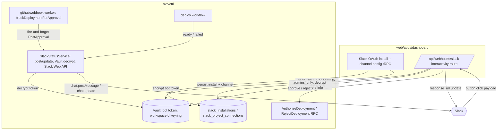

# Slack Deployment Notifications - Plan

## Goal Capsule

- **Objective:** Let a user connect their Slack workspace and receive per-project deployment notifications in a channel of their choice, with actionable links and the ability to approve or reject gated deployments directly from Slack.
- **Product authority:** Product decisions are settled in the Product Contract. This plan adds the technical HOW; it does not change product scope.
- **Product Contract preservation:** Product Contract unchanged except AE4, whose wording was made mechanism-neutral (the double-apply guard is specified in the Planning Contract, not the acceptance example). All R/A/F/AE IDs preserved.
- **Open blockers:** None. Deferred planning questions are resolved in the Planning Contract or listed as execution-time unknowns.

---

## Product Contract

### Summary

Add a customer-facing Slack integration for Unkey deployments. A user installs an "Add to Slack" OAuth app, picks a channel per project, and Unkey posts deployment events — `ready`, `failed`, and `awaiting_approval` — to that channel. Messages carry human-readable text, actionable links, and structured fields for AI-agent consumers. Approval-gated deployments include Approve and Reject buttons that act on the deployment from Slack, restricted to authorized users.

### Problem Frame

Unkey already runs deployments through a durable workflow and already reports each status transition outward to GitHub, but there is no way for a user to learn about their own deployments where their team actually works. Today the only Slack usage in the codebase is internal Unkey alerting through static webhook URLs — there is no customer-facing destination. A developer whose production deploy fails has to be watching the dashboard to know. The team's audiences vary — solo developers, teams, devops, and AI agents — but they share one need: the deployment's outcome, and a link to act on it, delivered to the channel they already watch. Approval gates sharpen this: a deployment paused on `awaiting_approval` is blocked until someone acts, so a notification that cannot be acted on just relocates the waiting.

### Key Decisions

- **OAuth app, not webhook paste.** Connection is a full Slack OAuth app ("Add to Slack") with a bot token stored per workspace and an in-dashboard channel picker, mirroring the existing GitHub App install precedent (`web/internal/db/src/schema/github_app.ts`, the OAuth handshake and tRPC router under `web/apps/dashboard`). Chosen over asking each user to hand-craft an Incoming Webhook URL because the channel is picked in-product and the audience expects a polished setup.
- **Interactive approval ships in v1.** `awaiting_approval` messages carry working Approve/Reject buttons. This makes the integration bidirectional (Slack to Unkey), not just outbound, and pulls in a Slack interactivity endpoint, signature verification, identity mapping, and audit logging as v1 scope.
- **Approval authorization is configurable, open by default.** By default any channel member (human or AI agent) may approve or reject. A project can be restricted so that only workspace admins — the WorkOS `admin` role — may act. Identity mapping (Slack user to Unkey/WorkOS identity) is only required in the restricted mode, to check the role; the open default just records who clicked.
- **Production-only by default, previews are opt-in — per channel.** Preview deployments fire on every push and would flood a channel, so a newly added channel defaults to production only. Each channel's production/preview scope is configurable independently.
- **Per-project, multiple channels.** Notification config attaches at the project level and fans out to any number of channels, each with its own environment scope (e.g. #deploys gets production, #previews gets previews). The approval policy remains project-level (strictest across a project's channel rows).
- **Curated event set.** Notify on `ready`, `failed`, and `awaiting_approval` only — the actionable outcomes. Intermediate build steps and other terminal states (`cancelled`, `superseded`, `stopped`, `skipped`) do not notify.
- **Reuse existing emission points and Slack client.** Emission slots into the deploy Restate workflow alongside the current GitHub status reporter, and extends the existing Block Kit client at `svc/ctrl/internal/slack/webhook.go`. This is an extend-existing-capability change for the outbound path.

### Actors

- A1. **Workspace admin** — installs the Slack app and configures the channel, environment scope, and approval policy per project.
- A2. **Channel member (human)** — reads notifications; if authorized, approves or rejects gated deployments from Slack.
- A3. **AI agent** — consumes the structured fields on each message; may act on approvals, subject to the same authorization as a human.
- A4. **Unkey deploy workflow (system)** — emits deployment events at lifecycle transitions.
- A5. **Slack** — delivers messages and posts interaction payloads back to Unkey.

### Requirements

**Connection and setup**

- R1. A workspace admin can install a Slack OAuth app from the dashboard; Unkey stores the resulting bot credentials securely, scoped per workspace, following the GitHub App install precedent including install-hijack hardening.
- R2. A user can connect any number of Slack channels per project as notification destinations, searching channels from a picker.
- R3. Each connected channel's environment scope is configurable independently: production-only by default, with per-channel toggles for production and preview deployments.
- R4. A user can send a test message from the dashboard to confirm the channel is connected and receiving.
- R5. A user can disconnect Slack from a project (and revoke the workspace install), after which no further notifications are sent.

**Notifications**

- R6. Unkey posts a notification when a deployment reaches `ready`, `failed`, or `awaiting_approval`, subject to the project's environment scope (R3).
- R7. Each message carries the link appropriate to its event: the deployment URL on `ready`, a link to the deployment logs on `failed`, and a link to review the deployment in the dashboard on `awaiting_approval`.
- R8. Each message carries visible structured fields usable by an AI agent: deployment ID, status, environment, project, commit SHA, commit message, and the deployment trigger/actor.

**Interactive approvals**

- R9. An `awaiting_approval` message carries Approve and Reject controls that resolve the gated deployment from Slack, driving the same approval action as the dashboard.
- R10. Approval authorization is configurable per project. By default any channel member may approve or reject. A project can be set to restrict approval to workspace admins (the WorkOS `admin` role); in that mode the acting Slack user is mapped to an Unkey identity and their role is checked before the action applies, and an unauthorized attempt is refused with feedback.
- R11. Inbound Slack interaction requests are verified by Slack request signature before any action is taken.
- R12. Every approve/reject action is audit-logged (acting Slack user, resolved to an Unkey identity when linkable, plus deployment, timestamp, and outcome), and the original message updates to reflect the resolved state so it cannot be acted on twice.

**Emission and reliability**

- R13. Emission slots into the existing deploy Restate workflow alongside the GitHub status reporter, and no-ops silently when the project has no Slack connection.
- R14. Notification delivery is durable and retryable, and never blocks, delays, or fails the deployment itself if Slack is unreachable.

### Key Flows

- F1. **Install and configure**
  - **Trigger:** A1 opens a project's integration settings and clicks "Add to Slack".
  - **Steps:** OAuth consent in Slack; bot credentials stored per workspace (R1); A1 selects a channel for the project (R2), sets environment scope (R3), and sets who may approve — anyone or admins only (R10); A1 optionally sends a test message (R4).
  - **Outcome:** The project has a live Slack destination.
  - **Covers:** R1, R2, R3, R4

- F2. **Deployment outcome notification**
  - **Trigger:** A4 transitions a deployment to `ready` or `failed` within the project's environment scope.
  - **Steps:** The deploy workflow's Slack reporter looks up the project connection; if connected, it posts a message with the event-appropriate link (R7) and structured fields (R8); if not connected, it no-ops (R13). Delivery is durable and non-blocking (R14).
  - **Outcome:** The channel shows the outcome with a link to the deployment URL or its logs.
  - **Covers:** R6, R7, R8, R13, R14

- F3. **Approval-gated deployment resolved from Slack**
  - **Trigger:** A4 transitions a deployment to `awaiting_approval`.
  - **Steps:** Unkey posts an approval message with Approve/Reject controls (R9). A2 or A3 clicks a control; Slack posts a signature-verified interaction payload (R11); Unkey binds the payload to the deployment's owning workspace, then — if the project restricts approval to admins — maps the actor to an Unkey identity and checks the WorkOS admin role, otherwise any actor is allowed (R10); on success the approval/rejection is applied, audit-logged, and the message updated (R12); a disallowed actor is refused (R10).
  - **Outcome:** The deployment proceeds or is rejected, with the decision recorded and the message reflecting the resolved state.
  - **Covers:** R9, R10, R11, R12

### Acceptance Examples

- AE1. **Covers R3, R6.** Given a project scoped to production only, when a preview deployment fails, then no message is posted. When that project is later configured to include previews, a failing preview deployment posts a `failed` message.
- AE2. **Covers R7.** Given a deployment reaches `ready`, when the message is posted, then it contains the live deployment URL. Given a deployment reaches `failed`, the message links to that deployment's logs.
- AE3. **Covers R10, R12.** Given a project using the default open policy, when any channel member clicks Approve, then the deployment proceeds and the message updates to an approved state. Given a project restricted to admins, when a non-admin clicks Approve, then the deployment is not approved and the actor is told they are not authorized; when a WorkOS admin clicks Approve, the deployment proceeds and the message updates.
- AE4. **Covers R12.** Given an approval message already resolved by one user, when a second user clicks a control, then the action is refused and not double-applied.
- AE5. **Covers R13, R14.** Given a project with no Slack connection, when any qualifying deployment event fires, then nothing is posted and the deployment is unaffected. Given Slack is unreachable, the deployment still completes and delivery is retried.

### Scope Boundaries

**Deferred for later**

- Per-environment routing to different channels, and multiple channels per project.
- Notifications for additional statuses (`cancelled`, `superseded`, `stopped`, `skipped`) or intermediate build steps.
- Notification event types beyond deployments.

**Outside this product's identity**

- A generic outbound-webhook or event-bus product. This is a Slack-specific integration, not a general notification platform.
- Internal Unkey alerting (the existing static-webhook Slack usage) is unchanged and separate.

**Deferred to Follow-Up Work**

- Retro-linking existing WorkOS/Slack identities into a dedicated mapping table. v1 resolves Slack users to Unkey users by email at click time (see KTD7); a persisted external-identity mapping is a later optimization.

### Dependencies and Assumptions

- Depends on the existing deploy Restate workflow (`svc/ctrl/worker/deploy/deploy_handler.go`) and its status transition points as the emission source.
- Depends on the `AuthorizeDeployment` ctrl Connect RPC (`svc/ctrl/services/deployment/authorize_deployment.go`) for the approve path, and on a new `RejectDeployment` RPC (U8) for the reject path.
- Depends on WorkOS for the admin-role check and the Slack-to-Unkey identity mapping used in the admin-restricted approval mode (R10). The open default does not require this mapping.
- Depends on the Vault service (`svc/vault`) to encrypt and decrypt the stored bot token, keyed by `workspaceId` (KTD3).
- Assumes the Slack app is a first-party Unkey-owned app (single app, per-workspace installs), mirroring the GitHub App model.

### Outstanding Questions

**Deferred to Planning** — all resolved below in the Planning Contract (KTDs). No blocking questions remain.

---

## Planning Contract

### Key Technical Decisions

- KTD1. **The interactivity endpoint lives in the dashboard**, not the Go control plane, as a raw route at `web/apps/dashboard/app/api/webhooks/slack/route.ts` mirroring the existing `stripe`/`workos` webhook routes. Rationale: resolving a Slack user to a WorkOS admin role (`auth.findUser`, `getOrganizationMemberList`), calling `createCtrlClient(DeployService).authorizeDeployment(...)`, and writing audit logs all already exist in the dashboard, which also has a Vault client for the bot-token decrypt the admin check needs. Replicating WorkOS role resolution in Go would be net-new and duplicative.
- KTD2. **A bot-token Slack Web API client is required and does not exist yet.** The current `svc/ctrl/internal/slack/webhook.go` is an incoming-webhook POST client only — it cannot render interactive buttons or update messages. Extend that package with a token-authed client (`chat.postMessage`, `chat.update`) and interactive Block Kit types (`actions` block, `button` element, `block_id`/`action_id`). Hand-rolled to match the repo's existing hand-rolled GitHub client, not the `slack-go` SDK.
- KTD3. **The bot token is stored Vault-encrypted and server-decryptable, keyed by `workspaceId`.** Use a `recoverable`-style encrypted column (decryptable server-side, never returned to the browser) — not `writeonly`, because both ctrl (posting) and the dashboard (`users.info` in admin mode) must decrypt it. A workspace install has no environment, so do **not** reuse the `environmentId` keyring that `app_environment_variables` uses; the keyring is `workspaceId` and must be identical at encrypt (U3) and every decrypt (U6, U9). Global app credentials (`SLACK_CLIENT_ID`, `SLACK_CLIENT_SECRET`, `SLACK_SIGNING_SECRET`) are env vars validated with a Zod schema (`slackAppEnv()`), mirroring `githubAppEnv()`; the signing secret lives dashboard-side where signatures are verified (U9).
- KTD4. **`SlackStatusService` is the single owner of all outbound Slack I/O**, mirroring the `githubstatus` Restate virtual object. A new hydra service keyed by deployment ID owns posting, updating, connection lookup, and bot-token decrypt (workspaceId keyring). It posts on `Init`, stores `channel`+`message_ts` in Restate K/V, edits on state changes, and exposes a `PostApproval` path (below). `initSlackStatus` looks up the connection inside `restate.Run`, returns a `connected:false` no-op reporter when the project has no Slack connection, and never returns an error for not-found (matching `initGitHubStatus`, which would otherwise cause infinite Restate retries).
- KTD5. **The `awaiting_approval` prompt is triggered from the GitHub-webhook worker but posted through `SlackStatusService`.** Gated deployments are created with status `awaiting_approval` and never handed to the Deploy workflow (`svc/ctrl/worker/githubwebhook/block_deployment.go`), so the deploy-workflow reporter never sees them. Rather than wire a Vault client and Slack client into the githubwebhook worker (which holds neither today), `blockDeploymentForApproval` fires a fire-and-forget `SlackStatusService.PostApproval(deploymentID)` via the Restate ingress client it already uses. This keeps all Slack I/O and token handling in one service, makes the prompt durable/retryable (R14), and — because the same deployment-keyed object holds `channel`+`ts` — lets the later outcome update the approval message in place rather than posting a second message.
- KTD6. **Approve reuses `AuthorizeDeployment`; reject is a new `RejectDeployment` Connect RPC.** `AuthorizeDeployment` already does the CAS `awaiting_approval → pending` transition and triggers the workflow. There is no reject RPC today — `CancelDeployment` is invocation-oriented and treats the no-invocation case as a silent success. Add `RejectDeployment` (CAS `awaiting_approval → cancelled`, distinct `deployment.reject` audit event) for clean semantics. Approve continues to emit the existing `deployment.authorize` event.
- KTD7. **Approval authorization is a per-project policy (`anyone` | `admins_only`), and policy/config mutations are admin-gated.** In `admins_only`, the dashboard interactivity handler decrypts the bot token (workspaceId keyring) to call `users.info`, resolves the email to a WorkOS user with `auth.findUser(email)`, then checks the workspace org role via `getOrganizationMemberList` for `role.slug === "admin"` — the same signal as the `requireWorkspaceAdmin` tRPC middleware. In `anyone`, no mapping is required for permission; the Slack user id/name is recorded for audit. The config mutations that set the policy (`updateConfig`) and the install/disconnect/revoke procedures are gated with `requireWorkspaceAdmin` so a non-admin cannot downgrade `admins_only` to `anyone` and self-approve.
- KTD8. **Environment scoping is enforced in the notifier.** The reporter skips a deployment whose environment is a preview unless the project's `include_previews` flag is set. Production-vs-preview is determined the same way the deploy workflow already distinguishes them (production triggers `swapLiveDeployment`; preview triggers `spinDownPreviousDeployments` in `deploy_handler.go`); if the environment row does not already carry a readable production/preview flag, exposing one is an execution-time detail (see Open Questions).
- KTD9. **The interactivity handler binds every action to the deployment's owning workspace, and the CAS is the authoritative resolution guard.** A valid Slack signature only proves the request came from *some* install of the first-party Unkey app, not from the workspace that owns the target deployment. So `action_id`/`block_id` are treated as lookup keys only: the handler re-derives the deployment's workspace server-side and requires the payload's `team.id` to equal that workspace's `slackInstallation.teamId` before acting, in **both** policy modes. Double-apply is prevented by the `CompareAndSwapDeploymentStatus` returning `FailedPrecondition` (the authoritative signal the handler surfaces), not by the `response_url` message update, which is best-effort UI and racy.

### High-Level Technical Design

**Service responsibilities.** All outbound Slack I/O — posting, updating, connection lookup, and bot-token decrypt — lives in the Go control plane (`svc/ctrl`) inside `SlackStatusService`. Inbound OAuth install, channel configuration, and interactivity (button clicks) live in the dashboard (`web/apps/dashboard`), where WorkOS identity, a Vault client, and the ctrl client already exist.



**Gated-deploy sequence (the hard path):**

```mermaid
sequenceDiagram
  participant GH as GitHub push
  participant WW as ctrl githubwebhook worker
  participant SS as ctrl SlackStatusService
  participant SL as Slack
  participant DH as dashboard /api/webhooks/slack
  participant AZ as ctrl Authorize/Reject RPC
  participant DW as ctrl deploy workflow

  GH->>WW: push -> deployment awaiting_approval
  WW->>SS: PostApproval(deploymentID) (fire-and-forget)
  SS->>SL: chat.postMessage (buttons + fields; store channel+ts)
  SL-->>DH: user clicks Approve/Reject (signed payload)
  DH->>DH: verify X-Slack-Signature + timestamp
  DH->>DH: bind payload team.id to deployment's workspace (KTD9)
  DH->>DH: policy check (anyone | admins_only via WorkOS role)
  DH->>AZ: AuthorizeDeployment (approve) or RejectDeployment (reject)
  DH->>SL: update message via response_url (resolved state)
  Note over AZ,DW: approve path only
  AZ->>DW: trigger Deploy workflow
  DW->>SS: report ready/failed
  SS->>SL: chat.update (ready -> URL / failed -> logs)
```

### Assumptions

- The Slack app's bot token scopes are `chat:write`, `chat:write.public` (post to public channels without a manual invite), `channels:read` / `groups:read` (channel picker), and `users:read` + `users:read.email` (admin-mode identity resolution — `users.info` requires `users:read`, and the email field requires `users:read.email`). The `SLACK_SCOPES` requested in the authorize URL must match these exactly or install fails with `invalid_scope`.
- ctrl can decrypt Vault-stored secrets at runtime (established by the deploy-time `SecretsConfig` path); the dashboard likewise has a Vault client (used by `app_environment_variables`).
- The interactivity handler uses `response_url` for the click-time message update (no token needed there); `admins_only` mode additionally decrypts the bot token to call `users.info`.

### Sequencing

Phase A (foundation) → Phase B (dashboard install/config) and Phase C (ctrl outbound) can proceed in parallel after A → Phase D (interactivity) depends on B and C. U8 (RejectDeployment RPC + audit events) depends only on U2 and can land in parallel with Phase C; only U9 (the interactivity endpoint) genuinely requires B and C complete. Within each phase, follow the per-unit dependencies.

---

## Implementation Units

### U1. Slack app configuration and secret plumbing

- **Goal:** Register global Slack app credentials on the dashboard so later units can read them.
- **Requirements:** R1 (supporting)
- **Dependencies:** none
- **Files:**
  - `web/apps/dashboard/lib/env.ts` (add `slackAppSchema` + `slackAppEnv()` for `SLACK_CLIENT_ID`, `SLACK_CLIENT_SECRET`, `SLACK_SIGNING_SECRET`; `NEXT_PUBLIC_SLACK_APP_NAME` for the button)
  - `web/internal/id/src/generate.ts` (add `slack` prefix to the `prefixes` union)
- **Approach:** Follow the `githubAppEnv()`/`githubOAuthEnv()` Zod `safeParse(process.env)` getter pattern. All credentials are global app identity; the per-workspace bot token is not an env var (it comes from Vault, KTD3). No ctrl `SlackConfig` change is needed — ctrl reads the bot token from Vault, and the signing secret is verified dashboard-side (U9). Leave the existing `SlackConfig.QuotaCheckWebhookURL` untouched.
- **Patterns to follow:** `githubAppSchema` in `web/apps/dashboard/lib/env.ts`; `prefixes` in `web/internal/id/src/generate.ts`.
- **Test scenarios:**
  - `slackAppEnv()` returns null when a required var is unset, and the parsed object when all are present.
  - `newId("slack")` produces a `slack_`-prefixed id.
- **Verification:** Type-checks; `newId` unit test passes.

### U2. Slack connection data model

- **Goal:** Persist the per-workspace install and per-project channel configuration, readable from both the dashboard (Drizzle) and ctrl (sqlc).
- **Requirements:** R1, R2, R3, R10
- **Dependencies:** U1
- **Files:**
  - `web/internal/db/src/schema/slack.ts` (new: `slackInstallations` — `pk`, `id`, `workspaceId`, `teamId`, `botToken` (Vault-encrypted, server-decryptable/recoverable; never returned to the browser), `botUserId`, `installedByUserId`, `...lifecycleDates`, unique on `(workspaceId, teamId)`; `slackProjectConnections` — `pk`, `id`, `workspaceId`, `projectId`, `installationId`, `channelId`, `channelName`, `includePreviews` (bool default false), `approvalPolicy` enum `["anyone","admins_only"]` default `anyone`, `...lifecycleDates`, unique on `projectId`)
  - `web/internal/db/src/schema/index.ts` (export `./slack`)
  - `web/internal/db/drizzle/` (generated migration)
  - `svc/ctrl/internal/db/queries/slack_project_connection_find_by_project_id.sql`, `slack_installation_find_by_workspace_id.sql`
- **Approach:** Mirror `web/internal/db/src/schema/github_app.ts` (pk + relations, no DB-level FK, `...lifecycleDates`). Store the bot token via a Vault-encrypted, server-decryptable column keyed by `workspaceId` (KTD3). Regenerate MySQL schema (`mise run generate-sql`) then ctrl queries (`mise run generate`). Connections are keyed by `projectId`; there is no `app_id` finder because notification config is per-project, not per-app.
- **Patterns to follow:** `github_app.ts`; `svc/ctrl/internal/db/queries/github_repo_connection_find_by_project_id.sql` and its `.sql_generated.go`.
- **Test scenarios:**
  - Migration applies cleanly; unique constraint on `projectId` rejects a second connection for the same project.
  - `FindSlackProjectConnectionByProjectId` returns the row for a connected project and a zero value (not an error) for an unconnected one.
  - `approvalPolicy` defaults to `anyone` and `includePreviews` to false on insert.
- **Verification:** `mise run generate` produces querier methods; targeted `bazel test` on the ctrl db package passes.
- **Execution note:** After adding Go files, run `mise run bazel`.

### U3. Slack OAuth install flow (dashboard)

- **Goal:** "Add to Slack" install with signed-state handshake, code exchange, team verification, and Vault-encrypted token persistence.
- **Requirements:** R1
- **Dependencies:** U1, U2
- **Files:**
  - `web/apps/dashboard/lib/trpc/routers/slack.ts` (new: `prepareInstallation` signs state; `registerInstallation` verifies state, exchanges `code` via `oauth.v2.access`, confirms returned `team.id`/authed user, Vault-encrypts (workspaceId keyring) and upserts `slackInstallations`)
  - `web/apps/dashboard/lib/trpc/routers/index.ts` (register `slack` router)
  - `web/apps/dashboard/app/(app)/integrations/slack/callback/page.tsx` (new: client callback page mirroring the GitHub callback)
- **Approach:** Mirror `web/apps/dashboard/lib/trpc/routers/github.ts` `prepareInstallation`/`registerInstallation`. Derive the state signing key from the Slack signing secret. Enforce `parsedState.workspaceId === ctx.workspace.id && parsedState.userId === ctx.user.id`, and refuse an install already bound to another workspace (`CONFLICT`) — this is the install-hijack hardening (R1). Gate `registerInstallation` with `requireWorkspaceAdmin` (KTD7, R1/A1).
- **Patterns to follow:** `github.ts` `signState`/`verifyState`/`registerInstallation`; `app/(app)/integrations/github/callback/page.tsx`; `requireWorkspaceAdmin` in `web/apps/dashboard/lib/trpc/trpc.ts`.
- **Test scenarios:**
  - `verifyState` rejects a tampered or expired state.
  - `registerInstallation` rejects when the state's workspace/user does not match the caller, and rejects a non-admin caller.
  - An install already bound to another workspace returns `CONFLICT`.
  - The stored bot token round-trips through Vault (encrypt on write with the workspaceId keyring; decryptable server-side, never returned to the browser).
- **Verification:** Targeted `pnpm --dir=web` vitest on the slack router passes.

### U4. Channel picker, per-project config, and test message (dashboard)

- **Goal:** Let a user pick a channel, set environment scope and approval policy, send a test message, and disconnect.
- **Requirements:** R2, R3, R4, R5, R10
- **Dependencies:** U3
- **Files:**
  - `web/apps/dashboard/lib/trpc/routers/slack.ts` (add `listChannels` via `conversations.list`, `selectChannel`, `updateConfig` for `includePreviews`/`approvalPolicy`, `sendTestMessage`, `disconnect`)
  - `web/apps/dashboard/app/(app)/[workspaceSlug]/projects/[projectId]/...` (project integration settings UI: channel dropdown, previews toggle, approval-policy select, test button, disconnect)
- **Approach:** `selectChannel` upserts `slackProjectConnections` (one per project). `sendTestMessage` posts directly from the dashboard via `chat.postMessage`, decrypting the bot token from Vault (workspaceId keyring) — there is no ctrl RPC for test messages. `disconnect` deletes the project connection; a workspace-level revoke deletes the installation and cascades to its project connections. Gate `updateConfig`, `disconnect`, and the workspace revoke with `requireWorkspaceAdmin` (KTD7) so a non-admin cannot flip `approvalPolicy`; `selectChannel`/`sendTestMessage` also require admin for consistency with install.
- **Patterns to follow:** `github.ts` `listRepositories`/`selectRepository`/`disconnectRepo`; existing project settings pages; `requireWorkspaceAdmin`.
- **Test scenarios:**
  - `selectChannel` twice for one project updates rather than duplicates (unique `projectId`).
  - `updateConfig` persists `includePreviews` and `approvalPolicy`, and rejects a non-admin caller.
  - `sendTestMessage` posts to the selected channel and surfaces a Slack API error to the user.
  - `disconnect` removes the project connection so subsequent notifications no-op (ties to R13 / AE5).
  - Covers R5. A workspace-level revoke deletes the installation and cascades to project connections, after which qualifying deployment events no-op.
- **Verification:** Targeted vitest passes; manual channel-pick + test-message smoke in a dev workspace.
- **Execution note:** Prefer an integration-style test for `sendTestMessage` that stubs the Slack Web API boundary.

### U5. Go Slack Web API client

- **Goal:** A bot-token client that can post and update interactive messages.
- **Requirements:** R7, R8, R9, R12 (supporting)
- **Dependencies:** U1, U2
- **Files:**
  - `svc/ctrl/internal/slack/webapi.go` (new: `WebClient` with `PostMessage` returning `channel`+`ts`, `UpdateMessage` for `chat.update`)
  - `svc/ctrl/internal/slack/webhook.go` (extend `Block`/element types with `actions` block, `button` element, `block_id`, `action_id`)
- **Approach:** Hand-rolled `net/http` client authed with `Authorization: Bearer <botToken>`, matching the hand-rolled GitHub client style. The caller (U6) supplies the decrypted token; this client does not itself touch Vault. Add Block Kit types needed for approve/reject buttons and structured fields. Keep the existing incoming-webhook `Send` for internal alerting untouched.
- **Patterns to follow:** `svc/ctrl/worker/github/client.go` (hand-rolled HTTP client); existing `slack.Payload`/block helpers.
- **Test scenarios:**
  - `PostMessage` sends the bearer token and returns parsed `channel`+`ts`; a non-ok Slack response is an error.
  - `UpdateMessage` targets the stored `channel`+`ts`.
  - Serializing an `actions` block with two buttons produces the expected Block Kit JSON (`action_id` per button).
- **Verification:** `bazel test` on the slack package passes against a stubbed HTTP transport.

### U6. SlackStatusService (outbound notifier: outcomes and approval prompt)

- **Goal:** The single owner of outbound Slack I/O — post/update deployment-outcome messages and the approval prompt, scoped and no-op-safe.
- **Requirements:** R6, R7, R8, R9, R13, R14
- **Dependencies:** U5, U2
- **Files:**
  - `svc/ctrl/proto/hydra/v1/slack_status.proto` (new: `SlackStatusService` VIRTUAL_OBJECT keyed by deployment ID; `Init`, `ReportStatus`, `PostApproval`)
  - `svc/ctrl/worker/slackstatus/service.go`, `init_handler.go`, `report_handler.go`, `post_approval_handler.go` (new; mirror `githubstatus`)
  - `svc/ctrl/worker/deploy/deploy_handler.go` (add `initSlackStatus` reporter and fire at the `ready`/`failed` call sites alongside `ghStatus`, ~lines 274-350; reuse `envURL`/`logURL` already built ~line 985-988)
  - `svc/ctrl/worker/run.go` (bind the new service; inject the U5 Slack Web API client and a Vault client into its config)
- **Approach:** Mirror `githubstatus`: `Init` posts via U5 and stores `channel`+`ts` in Restate K/V; `ReportStatus` edits; `PostApproval` posts the buttoned approval prompt (used by U7) and stores `channel`+`ts` so the later outcome can edit it. This service owns the bot-token decrypt (Vault, workspaceId keyring) and the connection lookup. `initSlackStatus` looks up `slackProjectConnections` inside `restate.Run`, returns a `connected:false` no-op reporter when unconnected, and never errors on not-found (KTD4). Enforce environment scoping (KTD8): skip preview deployments unless `includePreviews`. Populate structured fields (R8) from the deployment row and git metadata. Ensure `run.go` injects a real Slack client, not a silent no-op stub, when Slack config is present.
- **Patterns to follow:** `svc/ctrl/worker/githubstatus/service.go`, `init_handler.go`, `report_handler.go`; `initGitHubStatus` and its call sites in `deploy_handler.go`.
- **Test scenarios:**
  - Covers AE5. No connection → reporter is no-op and the deploy workflow is unaffected.
  - Covers AE1. Preview deployment with `includePreviews=false` posts nothing; with `true` it posts.
  - Covers AE2. `ready` message carries the live env URL; `failed` carries the dashboard logs URL.
  - Covers R8. Message includes deployment ID, status, environment, project, commit SHA, commit message, trigger/actor.
  - `PostApproval` posts a message with Approve/Reject buttons and stores `channel`+`ts`.
  - Slack unreachable inside `restate.Run` is retried and never fails the deployment (R14).
- **Verification:** `bazel test` on the slackstatus worker; integration test through the deploy harness (`svc/ctrl/integration/harness`).
- **Execution note:** Start from a failing integration test asserting the no-op-when-unconnected contract before wiring call sites.

### U7. Trigger the approval prompt from the githubwebhook worker

- **Goal:** Post the interactive approval prompt when a deployment is gated, without adding Slack/Vault clients to the webhook worker.
- **Requirements:** R6, R7, R8, R9, R14
- **Dependencies:** U6
- **Files:**
  - `svc/ctrl/worker/githubwebhook/block_deployment.go` (in `blockDeploymentForApproval`, fire a fire-and-forget `SlackStatusService.PostApproval(deploymentID)` via the Restate ingress client)
- **Approach:** The githubwebhook worker holds neither a Vault client nor a Slack client, so it does not post directly. It sends a fire-and-forget call to the deployment-keyed `SlackStatusService` (U6), which owns the token decrypt, connection lookup, no-op-when-unconnected behavior, and durable retry (R14). Encode the deployment ID and workspace in each button's `action_id`/`block_id` (defined in U6's block builders) so the interactivity handler (U9) can route and bind. The Restate object context guarantees the send never propagates an error back into the webhook handler (avoiding the infinite-retry hazard KTD4 guards against).
- **Patterns to follow:** the fire-and-forget `NewGitHubWebhookServiceIngressClient(...).Send(...)` pattern in `svc/ctrl/api/github_webhook.go`; existing `blockDeploymentForApproval`.
- **Test scenarios:**
  - Gated deployment with a connected project results in a `PostApproval` send carrying the deployment ID and workspace.
  - Unconnected project → `SlackStatusService` no-ops (nothing posted, R13).
  - Slack unreachable → the prompt send is retried by Restate and never fails the webhook handler (R14).
- **Verification:** `bazel test` on the githubwebhook worker; integration test asserting the buttoned message via the deploy harness.

### U8. RejectDeployment RPC and approval audit events

- **Goal:** A clean reject transition and audit event definitions for both decisions.
- **Requirements:** R10, R12
- **Dependencies:** U2
- **Files:**
  - `svc/ctrl/proto/ctrl/v1/...` deploy service proto (add `RejectDeployment` RPC)
  - `svc/ctrl/services/deployment/reject_deployment.go` (new: CAS `awaiting_approval → cancelled`)
  - `pkg/auditlog/events.go` and `web/internal/schema/src/auditlog.ts` (add `deployment.reject` event; approve reuses the existing `deployment.authorize` event)
  - `pkg/auditlog/actors.go` and `web/internal/schema/src/auditlog.ts` (add a `slack` actor type, or accept a `user`/`system` actor carrying the Slack user id/name in `ActorMeta` for the unlinkable `anyone`-mode case)
  - `web/apps/dashboard/lib/trpc/routers/deploy/deployment/` (thin passthrough for reject, mirroring `authorize.ts`)
- **Approach:** Mirror `authorize_deployment.go`'s CAS + guard pattern (reject only from `awaiting_approval`, `CodeFailedPrecondition` otherwise). This unit defines the RPC and the audit event/actor vocabulary; the audit *write* for Slack-initiated actions happens in U9 (only it holds the Slack actor identity). Dashboard-tRPC-initiated reject writes its own audit entry the way `authorize.ts` does for authorize.
- **Patterns to follow:** `svc/ctrl/services/deployment/authorize_deployment.go`; `web/apps/dashboard/lib/trpc/routers/deploy/deployment/authorize.ts` (audit write); `pkg/auditlog/actors.go`.
- **Test scenarios:**
  - `RejectDeployment` on an `awaiting_approval` deployment sets status `cancelled`; a concurrent update (rowsAffected 0) returns `CodeFailedPrecondition`.
  - `RejectDeployment` on a non-gated deployment is refused.
  - The `deployment.reject` event and the Slack actor shape validate against `web/internal/schema/src/auditlog.ts` (including an actor with no Unkey user id).
- **Verification:** `bazel test` on the deployment service package.

### U9. Slack interactivity endpoint (dashboard)

- **Goal:** Receive button clicks, authenticate and authorize them, act, and resolve the message.
- **Requirements:** R9, R10, R11, R12
- **Dependencies:** U6, U7, U8
- **Files:**
  - `web/apps/dashboard/app/api/webhooks/slack/route.ts` (new)
- **Approach:** Verify `X-Slack-Signature` (`v0=` HMAC-SHA256 over `v0:{X-Slack-Request-Timestamp}:{rawBody}`) with a constant-time compare and a stale-timestamp replay guard, reading the raw body. Parse the `payload` form field and extract the deployment ID from `action_id`/`block_id` as a **lookup key only**. Re-derive the deployment's owning workspace server-side, load that workspace's `slackInstallation`, and require `payload.team.id === installation.teamId` before any action, in both policy modes (KTD9). Load the project's `approvalPolicy`; in `admins_only`, decrypt the bot token (Vault, workspaceId keyring), call `users.info` for the clicker's email, `auth.findUser(email)`, and check the WorkOS org role is `admin` (KTD7) — refuse otherwise via an ephemeral response. Call `createCtrlClient(DeployService).authorizeDeployment(...)` (approve) or `rejectDeployment(...)` (U8, reject); treat the CAS `FailedPrecondition` as the authoritative "already resolved" signal surfaced to the user (KTD9). Update the original message to the resolved state via `response_url` (best-effort UI). Write the audit event here (owns the R12 write); do not log resolved emails to general logs.
- **Patterns to follow:** `web/apps/dashboard/app/api/webhooks/{stripe,workos}/route.ts` (raw-body signature verification); `web/apps/dashboard/app/api/v1/github/verify/route.ts` (`getOrganizationMemberList`/`getUser` fan-out); `authorize.ts` (ctrl client + audit).
- **Test scenarios:**
  - Covers R11. A request with an invalid or missing signature, or a stale timestamp, is rejected (401) with no action taken.
  - Covers KTD9. A signed payload whose `team.id` does not match the deployment's workspace installation is refused (403), no action taken — in both policy modes.
  - Covers AE3 (open). `anyone` policy: a matching-team Slack user's Approve proceeds; message updates to approved.
  - Covers AE3 (restricted). `admins_only`: a non-admin's Approve is refused with feedback; a WorkOS admin's Approve proceeds.
  - Covers AE4. A click on a deployment no longer `awaiting_approval` gets a CAS `FailedPrecondition` and is refused without double-applying, even if the `response_url` update has not landed.
  - Covers R12. Approve and reject update the message and write an audit entry naming the actor.
- **Verification:** Targeted vitest with a signed test payload; integration smoke against a dev Slack app.
- **Execution note:** Write the signature-verification and team-binding tests first — they are the security boundary.

---

## Alternative Approaches Considered

- **Interactivity endpoint in the Go control plane** (mirroring `github_webhook.go`). Keeps all inbound Slack traffic in one service, but requires replicating WorkOS admin-role resolution and per-user identity in Go, which does not exist there today. Rejected in favor of KTD1.
- **`slack-go` SDK** instead of a hand-rolled client. Less code, but a new dependency against the repo's avoid-new-deps guidance and inconsistent with the hand-rolled GitHub client. Rejected in favor of KTD2.
- **Incoming-webhook posting** (reuse the existing client). Cannot render interactive buttons or update messages, so it cannot satisfy R9/R12. Rejected.
- **A bespoke direct post from the githubwebhook worker for the approval prompt.** Would require wiring a Vault client and a Slack client into a worker that has neither, duplicating connection-lookup and no-op logic and giving up Restate durability. Rejected in favor of routing through `SlackStatusService` (KTD5), which also enables single-message resolution.

---

## Risk Analysis & Mitigation

- **Cross-tenant approval.** A valid signature does not prove tenancy; mitigated by binding `payload.team.id` to the deployment's workspace installation in both modes (KTD9), and by the server-side CAS as the authoritative resolution guard.
- **Policy-downgrade bypass.** A member flipping `admins_only → anyone` to self-approve; mitigated by admin-gating `updateConfig` and the install/disconnect/revoke procedures (KTD7).
- **Notification spam from previews.** Mitigated by production-only default + `includePreviews` opt-in (KTD8, AE1).
- **Unauthorized approval in `anyone` mode.** Any actor who can deliver a matching-team signed click can approve — this is the user's explicit product choice; the audit record (R12) is the control, and the enforced bound is "matching-team signed click," not channel membership (see Open Questions).
- **Replay of a captured interaction payload.** Mitigated by the timestamp freshness check in U9 plus the per-deployment CAS (a replayed payload targets a deployment no longer `awaiting_approval`).
- **Restate infinite retry on a transient Slack error.** Mitigated by the no-op-on-not-found rule (KTD4), fire-and-forget sends (KTD5), and errors never propagating out of the webhook handler; notification failures never fail the deployment (R14).
- **Bot token leakage.** Mitigated by Vault encryption keyed to `workspaceId` (KTD3); the token is never returned to the browser and resolved emails are not written to general logs.

---

## Verification Contract

| Check | Command | Applies to |
|---|---|---|
| ctrl Go unit/integration tests | `mise exec -- bazel test //svc/ctrl/...` (narrow to touched targets) | U2, U5, U6, U7, U8 |
| Regenerate DB/query/proto code | `mise run generate` | U2, U6, U8 |
| Bazel graph after new Go files | `mise run bazel` | U2, U5, U6, U7, U8 |
| Dashboard tests | `mise exec -- pnpm --dir=web test` (narrow to slack router / webhook route) | U3, U4, U9 |
| Drizzle migration | `mise exec -- pnpm --dir=web/internal/db generate` | U2 |
| Formatting | `mise run fmt` | all |

---

## Definition of Done

The DoD splits into **automated gates** (agent-executable in CI/sandbox) and one **manual pre-merge acceptance** step. The original DoD conflated the two; a live third-party OAuth smoke requiring human consent and Slack-issued credentials is categorically a human acceptance step, not an automated gate (the Dependencies/Assumptions section already records that live Slack needs real credentials). Both parts are required to merge; only the automated gates are agent-closable.

### Automated gates — MET

- R1–R14 satisfied and traceable to units: connection/setup (U1–U4), notifications (U5–U7), interactive approvals (U8–U9), emission/reliability (U6–U7). All build and typecheck.
- Acceptance Examples exercised by named, passing tests:
  - AE1 (preview scoping) + AE5 (no-op when unconnected) — `svc/ctrl/worker/slackstatus/resolve_integration_test.go` (real MySQL via the deploy harness).
  - AE2 (link per state) — `svc/ctrl/worker/slackstatus/message_test.go`.
  - AE3 (approval policy: open vs admins-only) — `web/apps/dashboard/lib/slack.test.ts` (`authorizeSlackApproval`).
  - AE4 (double-apply guard is the CAS `FailedPrecondition`) — `svc/ctrl/services/deployment/reject_deployment_integration_test.go` (real MySQL).
  - KTD9 (tenant binding) + R11 (signature/replay) — `web/apps/dashboard/lib/slack.test.ts` (`isTeamBound`, `verifySignature`).
  - U6↔U9 `block_id` contract — asserted on both the Go producer (`message_test.go`) and TS consumer (`slack.test.ts`).
  - U5 Web API client — `svc/ctrl/internal/slack/webapi_test.go`.
- No notification path can block, delay, or fail a deployment (R14) — fire-and-forget + no-op-on-not-found, exercised by the slackstatus tests.
- The bot token is never returned to the browser (`recoverable`, server-decrypt only), and a signed interaction from a non-owning Slack workspace cannot resolve a deployment (KTD9 test).
- Verification Contract gates green: `bazel build`/`test` (slack, slackstatus, deployment, ctrl worker), `pnpm typecheck` (0 errors), `vitest`, `mise run generate`, `mise run fmt`.

### Manual pre-merge acceptance — REQUIRED, human-owned (not agent-executable)

Owner: a reviewer with Slack-workspace admin access. Cannot be automated — it needs a registered first-party Slack app (`SLACK_CLIENT_ID`/`SLACK_CLIENT_SECRET`/`SLACK_SIGNING_SECRET`/`SLACK_REDIRECT_URI`), a publicly reachable stack, and a human clicking buttons.

1. Create the Slack app (scopes `chat:write`, `channels:read`, `groups:read`, `users:read.email`; interactivity URL `https://<host>/api/webhooks/slack`; redirect `https://<host>/integrations/slack/callback`) and set the four env vars.
2. Project → Settings → "Add to Slack" → consent → pick a channel.
3. Trigger a production deploy → a "Deploying…" message edits to ✅ ready (deployment URL) or ❌ failed (logs link). (AE2)
4. Set policy `admins_only`, open an external-contributor PR → approval prompt with Approve/Reject; non-admin click refused, admin click proceeds and the message shows the resolved state. (AE3, R12)
5. Set a project production-only, push a preview → no message posted. (AE1)
